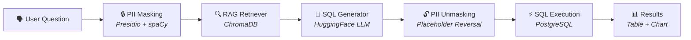
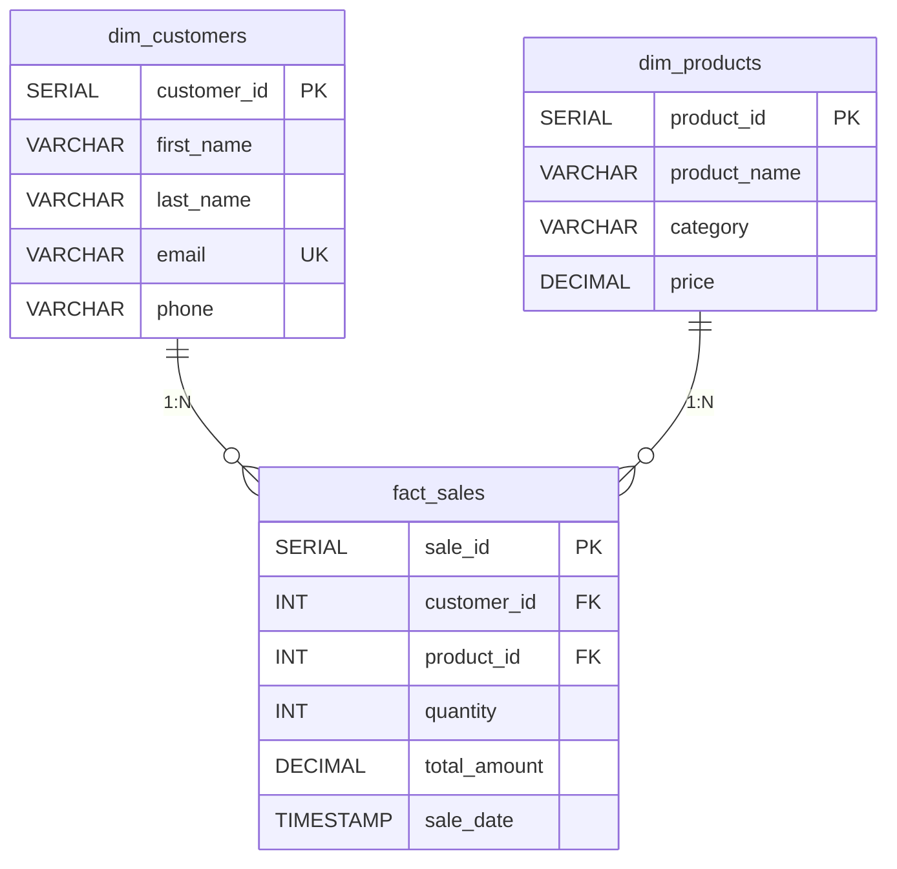

<div align="center">

# 📊 BI Analyst Agent

### AI-Powered Natural Language to SQL with Real-Time Interactive Dashboard

[](https://python.org)
[](https://streamlit.io)
[](https://postgresql.org)
[](https://langchain-ai.github.io/langgraph/)
[](https://huggingface.co)
[](LICENSE)

An end-to-end AI-powered Business Intelligence agent that converts natural language questions into executable PostgreSQL queries using a multi-node **LangGraph** pipeline with **PII masking**, **RAG-based query retrieval**, and a real-time **Streamlit** dashboard with interactive drill-down visualizations.

[Features](#-features) · [Architecture](#-architecture) · [Tech Stack](#-tech-stack) · [Getting Started](#-getting-started) · [Usage](#-usage) · [Database Schema](#-database-schema)

</div>

---

## ✨ Features

### 🤖 AI Agent Pipeline
- **Natural Language to SQL** — Ask questions in plain English, get executable PostgreSQL queries
- **4-Node LangGraph Pipeline** — Masking → RAG Retrieval → SQL Generation → Unmasking
- **Privacy-by-Design** — PII (names, emails) is masked before reaching the LLM using Microsoft Presidio
- **RAG-Augmented Generation** — Semantic search over curated SQL templates via ChromaDB for improved query accuracy
- **Self-Correcting Prompts** — Failed queries feed error context back to the LLM for automatic correction

### 📊 Interactive Dashboard
- **4 Real-Time KPI Cards** — Total Revenue, Total Orders, Unique Customers, Avg Order Value
- **3-Level Click-to-Drill-Down Charts** — Powered by Plotly interactive events
  - **Category Revenue** → Click bar → Product-level breakdown
  - **Monthly Revenue Trend** → Click data point → Daily breakdown
  - **Top Customers** → Click bar → Complete order history
- **AI Chat Panel** — Conversational interface with suggested starter questions
- **Auto-Refresh** — Dashboard refreshes every 60 seconds with cached queries
- **Dark Theme UI** — Custom-designed with glassmorphism cards, gradient accents, and monospace typography

### 🔒 Privacy & Security
- **PII Masking** — Names and emails are replaced with deterministic placeholders before LLM inference
- **PII Unmasking** — Placeholders are reversed after SQL generation for correct query execution
- **Zero PII Leakage** — User data never leaves the local environment to reach external APIs

---

## 🏗 Architecture

### High-Level System Architecture

```
┌─────────────────────────────────────────────────────────────────────┐
│                        STREAMLIT FRONTEND                          │
│  ┌──────────────┐  ┌──────────────────┐  ┌───────────────────────┐ │
│  │  KPI Cards   │  │  Drill-Down      │  │   AI Chat Panel       │ │
│  │  (4 metrics) │  │  Charts (Plotly) │  │   (NL → SQL → Table) │ │
│  └──────┬───────┘  └────────┬─────────┘  └───────────┬───────────┘ │
│         │                   │                         │             │
│         └───────────────────┼─────────────────────────┘             │
│                             │                                       │
│                    ┌────────▼────────┐                              │
│                    │  SQLAlchemy     │                              │
│                    │  Engine Pool    │                              │
│                    └────────┬────────┘                              │
└─────────────────────────────┼──────────────────────────────────────┘
                              │
              ┌───────────────▼───────────────┐
              │         PostgreSQL             │
              │  ┌─────────┐ ┌──────────────┐ │
              │  │  Fact &  │ │  7 Pre-      │ │
              │  │  Dim     │ │  computed    │ │
              │  │  Tables  │ │  Views       │ │
              │  └─────────┘ └──────────────┘ │
              └───────────────────────────────┘
```

### LangGraph Agent Pipeline



### Pipeline Node Details

| # | Node | Input | Output | Technology |
|---|------|-------|--------|------------|
| 1 | **Masking** | Raw question with PII | Masked question + PII map | Presidio AnalyzerEngine + AnonymizerEngine, spaCy `en_core_web_lg` |
| 2 | **Retriever** | Masked question | Closest SQL template | ChromaDB semantic search (10 curated Q-SQL pairs) |
| 3 | **Generator** | Masked question + SQL template + schema | Generated SQL query | HuggingFace API — MiniMax-M2.5:novita (temp=0.1) |
| 4 | **Unmasking** | SQL with placeholders + PII map | Final executable SQL | String replacement (`PERSON_PLACEHOLDER_0` → original name) |

### PII Masking Flow

```
User Input:  "How much did Rahul Sharma spend?"
                    │
                    ▼
Masked Query: "How much did PERSON_PLACEHOLDER_0 spend?"
PII Map:      {"PERSON_PLACEHOLDER_0": "Rahul Sharma"}
                    │
                    ▼
Generated SQL: SELECT SUM(total_amount) FROM fact_sales s
               JOIN dim_customers c ON s.customer_id = c.customer_id
               WHERE c.first_name || ' ' || c.last_name = 'PERSON_PLACEHOLDER_0'
                    │
                    ▼
Unmasked SQL:  SELECT SUM(total_amount) FROM fact_sales s
               JOIN dim_customers c ON s.customer_id = c.customer_id
               WHERE c.first_name || ' ' || c.last_name = 'Rahul Sharma'
```

---

## 🛠 Tech Stack

| Category | Technology | Purpose |
|----------|-----------|---------|
| **AI Orchestration** | LangGraph (StateGraph) | Multi-node agent workflow with typed state management |
| **LLM Provider** | HuggingFace Inference Router | OpenAI-compatible LLM API endpoint |
| **LLM Model** | MiniMaxAI/MiniMax-M2.5:novita | Text-to-SQL generation (temperature=0.1) |
| **LLM Client** | OpenAI Python SDK | OpenAI-compatible API client |
| **PII Protection** | Microsoft Presidio (Analyzer + Anonymizer) | Named Entity Recognition & anonymization |
| **NLP Backbone** | spaCy `en_core_web_lg` | NER model for Presidio entity detection |
| **Vector Database** | ChromaDB (PersistentClient) | Semantic similarity search for RAG |
| **Relational Database** | PostgreSQL 15+ | Primary data warehouse (star schema) |
| **ORM** | SQLAlchemy 2.0+ | Connection pooling & parameterized query execution |
| **DB Driver** | psycopg2-binary | PostgreSQL wire-protocol adapter |
| **Frontend** | Streamlit 1.32+ | Interactive web dashboard framework |
| **Visualization** | Plotly (Express + Graph Objects) | Interactive charts with click events |
| **Data Processing** | Pandas | DataFrame manipulation & SQL result handling |
| **Env Config** | python-dotenv | Secure credential management via `.env` |

---

## 🚀 Getting Started

### Prerequisites

- **Python 3.10+**
- **PostgreSQL 15+** (running locally or remote)
- **HuggingFace Account** (free API token)

### 1. Clone the Repository

```bash
git clone https://github.com/<your-username>/bi-analyst-agent.git
cd bi-analyst-agent
```

### 2. Create a Virtual Environment

```bash
python -m venv venv

# Windows
venv\Scripts\activate

# macOS/Linux
source venv/bin/activate
```

### 3. Install Dependencies

```bash
pip install -r requirements.txt
```

### 4. Download the spaCy NLP Model

```bash
python -m spacy download en_core_web_lg
```

### 5. Set Up Environment Variables

Create a `.env` file in the project root:

```env
DB_HOST=localhost
DB_NAME=bi
DB_USER=postgres
DB_PASSWORD=your_password
DB_PORT=5432
HF_TOKEN=hf_your_huggingface_token
```

> 💡 Get your free HuggingFace token at [huggingface.co/settings/tokens](https://huggingface.co/settings/tokens)

### 6. Set Up the Database

Create the PostgreSQL database and load the schema:

```bash
# Create the database
psql -U postgres -c "CREATE DATABASE bi;"

# Load schema, seed data, and views
psql -U postgres -d bi -f schema.sql
```

### 7. Initialize the ChromaDB Vector Store

```bash
python create_chromadb.py
```

### 8. Verify Database Connection

```bash
python test_connection.py
```

Expected output:
```
✅ Connection Successful! The BI Agent can now talk to the database.
📊 Verified: Found 500 rows in the fact_sales table.
```

### 9. Launch the Dashboard

```bash
streamlit run app2.py
```

The dashboard will open at `http://localhost:8501`

---

## 💡 Usage

### Dashboard

The dashboard is split into two panels:

| Panel | Features |
|-------|----------|
| **Left — Dashboard** | KPI cards, interactive charts with drill-down on click |
| **Right — AI Chat** | Ask questions in English, get SQL + results + auto-charts |

### Example Questions for the AI Chat

| Question | What It Does |
|----------|-------------|
| *"Who spent the most money?"* | Finds top customer by total spending |
| *"Top 3 products by revenue?"* | Ranks products by revenue |
| *"Monthly sales trend?"* | Shows month-over-month revenue |
| *"How much did John spend?"* | PII-aware query for a specific customer |
| *"Total orders this month?"* | Current month order count |
| *"Show revenue by category"* | Category-wise revenue breakdown |

### Drill-Down Interactions

1. **Category Chart** — Click any bar → see products within that category
2. **Monthly Trend** — Click any data point → see daily breakdown for that month  
3. **Top Customers** — Click any bar → see all orders by that customer

---

## 🗄 Database Schema

### Star Schema Design



### Data Volume

| Table | Rows | Description |
|-------|------|-------------|
| `dim_customers` | 500 | Customers with realistic PII (names, emails, phones) |
| `dim_products` | 15 | Products across 4 categories: Electronics, Furniture, Accessories, Office |
| `fact_sales` | 500 | Sales transactions spanning 12 months |

### Pre-Computed Database Views (7)

| View | Description |
|------|-------------|
| `vw_total_revenue` | Aggregate total revenue |
| `vw_category_revenue` | Revenue grouped by product category |
| `vw_category_product_drilldown` | Per-product metrics within each category |
| `vw_monthly_trend` | Month-over-month revenue trend |
| `vw_monthly_daily_drilldown` | Daily revenue within each month |
| `vw_top_customers` | Top 5 customers by total spend |
| `vw_customer_orders_drilldown` | Full order history per customer |
| `vw_top_products` | Top 5 products by revenue |

### Indexes (Performance Optimization)

```sql
CREATE INDEX idx_fact_sales_customer_id ON fact_sales(customer_id);
CREATE INDEX idx_fact_sales_product_id  ON fact_sales(product_id);
CREATE INDEX idx_fact_sales_sale_date   ON fact_sales(sale_date);
```

---

## 📂 Project Structure

```
bi-analyst-agent/
├── app2.py                 # Main Streamlit dashboard (production)
├── app.py                  # Simpler/earlier version of the dashboard
├── agent_graph.py          # LangGraph 4-node agent pipeline
├── mask_pii.py             # PII masking module (Microsoft Presidio)
├── create_chromadb.py      # ChromaDB vector store initialization
├── generate_schema.py      # Schema + seed data + views generator
├── schema.sql              # Generated DDL/DML (1134 lines)
├── test_connection.py      # Database connection verification
├── debug.py                # Environment variable debugging
├── requirements.txt        # Python dependency manifest
├── .env                    # Environment variables (not tracked)
├── .gitignore              # Git ignore rules
└── chroma_db/              # ChromaDB persistent storage
    └── chroma.sqlite3      # Vector embeddings database
```

---

## ⚙️ Caching Strategy

The application implements multi-layer caching for performance:

| Layer | TTL | Mechanism | Purpose |
|-------|-----|-----------|---------|
| **DB Engine** | Permanent | `@st.cache_resource` | Connection pool reuse (no reconnects on refresh) |
| **Dashboard Queries** | 60 seconds | `@st.cache_data(ttl=60)` | Avoid re-querying PostgreSQL every refresh cycle |
| **LLM Responses** | 5 minutes | `@st.cache_data(ttl=300)` | Same question doesn't re-call the LLM API |
| **Agent Loading** | Permanent | `@st.cache_resource` | LangGraph pipeline compiled once |

---

## 🧠 Prompt Engineering

The SQL generator uses a carefully engineered prompt with:

- **Full schema injection** — Table structures embedded directly in the prompt context
- **Explicit constraint rules** — Prevents common LLM mistakes (e.g., *"dim_customers has NO customer_name column — always use `first_name || ' ' || last_name`"*)
- **PII-aware instructions** — Tells the LLM to treat `PERSON_PLACEHOLDER_X` as literal values
- **RAG template guidance** — Retrieved SQL template injected as a reference
- **Error self-correction** — Previous query errors appended for the LLM to fix
- **Low temperature (0.1)** — Near-deterministic output for consistent SQL

---

## 🔧 Configuration

### Environment Variables

| Variable | Description | Example |
|----------|-------------|---------|
| `DB_HOST` | PostgreSQL host | `localhost` |
| `DB_NAME` | Database name | `bi` |
| `DB_USER` | Database user | `postgres` |
| `DB_PASSWORD` | Database password | `your_password` |
| `DB_PORT` | Database port | `5432` |
| `HF_TOKEN` | HuggingFace API token | `hf_xxxxx` |

---

## 🤝 Contributing

1. Fork the repository
2. Create your feature branch (`git checkout -b feature/amazing-feature`)
3. Commit your changes (`git commit -m 'Add amazing feature'`)
4. Push to the branch (`git push origin feature/amazing-feature`)
5. Open a Pull Request

---

## 📄 License

This project is licensed under the MIT License — see the [LICENSE](LICENSE) file for details.

---

## 🙏 Acknowledgements

- [LangGraph](https://langchain-ai.github.io/langgraph/) — Agent orchestration framework
- [HuggingFace](https://huggingface.co/) — LLM inference API
- [Microsoft Presidio](https://microsoft.github.io/presidio/) — PII detection & anonymization
- [ChromaDB](https://www.trychroma.com/) — Open-source vector database
- [Streamlit](https://streamlit.io/) — Python web application framework
- [Plotly](https://plotly.com/) — Interactive data visualization

---

<div align="center">

**Built with ❤️ using LangGraph, HuggingFace, Presidio, ChromaDB, PostgreSQL & Streamlit**

</div>
